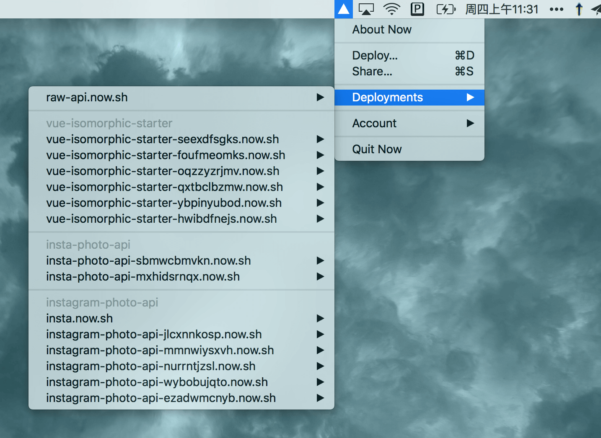

# menus [](https://npmjs.com/package/menus) [](https://npmjs.com/package/menus)

A short-hand for you to build something like:



## Install

```bash
$ npm install --save menus
```

## Usage

```js
const Menus = require('menus')

const menus = new Menus()

menus.setMenu([
  {
    label: 'My First Menu Item',
    click() {
      console.log('clicked!')
    }
  }
])

menus.start()

menus.on('ready', () => {
  console.log('Menus app is ready!')
})
```

For a more complete example, please check out [example](./example/index.js).

## API

### new Menus([options])

```js
const menus = new Menus()
```

#### options.icon

Path to tray icon.

#### options.showDockIcon

Default: `false`

Whether to show dock icon.

#### options.tooltip

Default: `''`

The tooltip to show when tray icon is hovered.

### menus.on('ready')

Emitted when a tray is created on the menubar.

### menus.setMenu(menu)

Set context menu for the tray icon. The doc of menu is [here](https://github.com/electron/electron/blob/master/docs/api/menu.md).

### menus.start()

Bootstrap the menus app.

### menus.app

The electron.app instance.

### menus.tray

The created tray instance. 

## Contributing

1. Fork it!
2. Create your feature branch: `git checkout -b my-new-feature`
3. Commit your changes: `git commit -am 'Add some feature'`
4. Push to the branch: `git push origin my-new-feature`
5. Submit a pull request :D

## License

[MIT](https://egoist.mit-license.org/) © [EGOIST](https://github.com/egoist)
